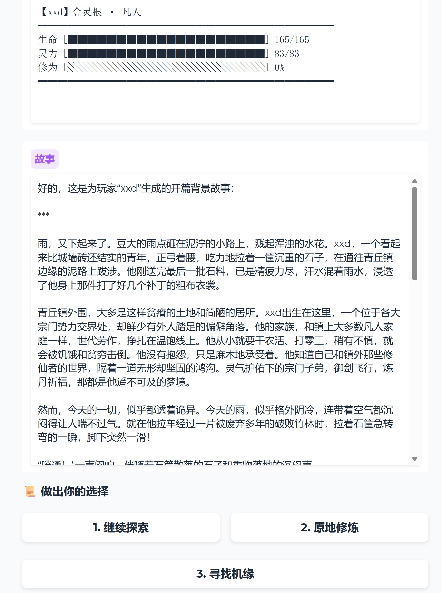
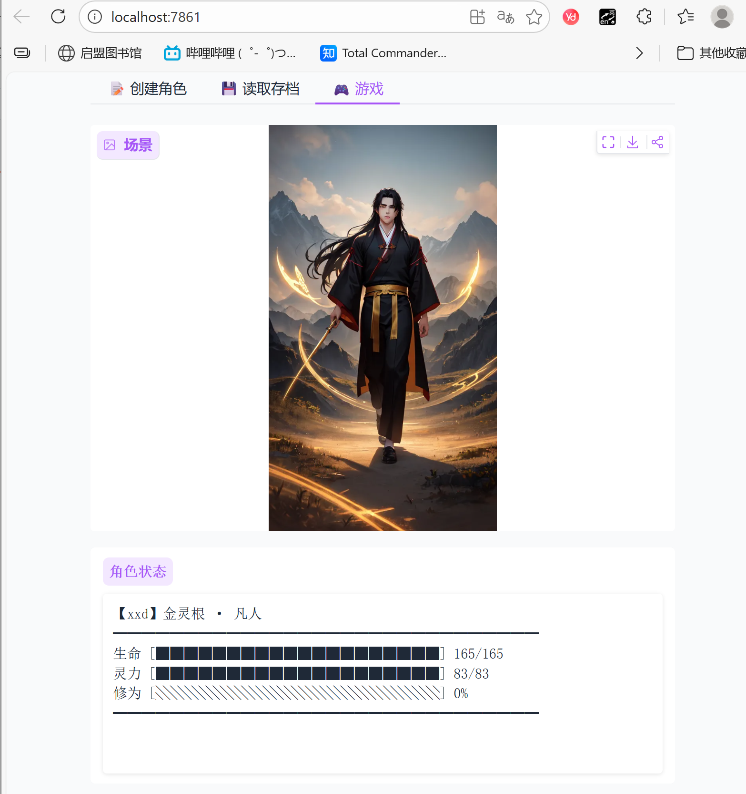

# 《仙途问道》- AI驱动的交互式修仙游戏

一款基于 OpenAI API 的交互式文字修仙游戏。游戏使用 AI 自动生成背景故事、续写剧情，并提供多个选项供玩家选择，打造独一无二的修仙体验。

## 特性

- 🎭 **AI故事生成** - 使用 OpenAI API 自动生成引人入胜的修仙故事
- 🔄 **动态剧情续写** - 根据玩家选择自动续写故事，每次游玩都是独特体验
- 🎮 **多选项交互** - 每个场景提供 2-4 个选项，玩家决定角色命运
- 👤 **角色成长系统** - 完整的修仙境界体系（炼气→筑基→金丹→元婴...）
- 💾 **存档功能** - 随时保存和加载游戏进度
- 🎨 **精美界面** - 命令行版本 + 图形界面版本（手机屏幕风格）
- 🖼️ **AI绘图** - 集成 Stable Diffusion，每次故事更新自动生成场景图片
- 📺 **直播互动** - 支持B站/抖音弹幕投票和礼物互动
- 🏆 **排行榜系统** - 贡献榜、参与榜、幸运榜

## 修仙境界

| 境界 | 描述 |
|------|------|
| 凡人 | 尚未踏入修仙之路 |
| 炼气期 | 感知天地灵气，初窥仙道 |
| 筑基期 | 筑就道基，正式踏入修仙之路 |
| 金丹期 | 凝聚金丹，寿元大增 |
| 元婴期 | 元婴出窍，神魂可离体 |
| 化神期 | 化神合道，领悟天道法则 |
| 炼虚期 | 炼虚合道，虚空挪移 |
| 合体期 | 天人合一，掌控天地之力 |
| 大乘期 | 大乘圆满，即将飞升 |
| 渡劫期 | 渡过天劫，飞升仙界 |

## 灵根系统

游戏包含多种灵根类型，每种灵根提供不同的属性加成：

- **金灵根** - 体魄+3, 神识+1
- **木灵根** - 悟性+2, 心境+2
- **水灵根** - 神识+3, 心境+1
- **火灵根** - 神识+2, 体魄+2
- **土灵根** - 体魄+2, 心境+2
- **雷灵根** - 神识+4
- **冰灵根** - 神识+2, 悟性+2
- **天灵根** - 悟性+3, 机缘+2
- **混沌灵根** - 全属性+2

## 快速开始

### 1. 安装依赖

```bash
pip install -r requirements.txt
```

### 2. 配置 API 密钥

**方法一：设置环境变量（推荐）**

Windows:
```cmd
set OPENAI_API_KEY=your-api-key-here
```

Linux/Mac:
```bash
export OPENAI_API_KEY=your-api-key-here
```

**方法二：修改配置文件**

编辑 `config.py` 文件，修改以下变量：
```python
OPENAI_API_KEY = "your-api-key-here"
```

### 3. 运行游戏

**命令行版本：**
```bash
python main.py
```

**图形界面版本（桌面）：**
```bash
python gui_game.py
```

**Web版本（推荐，避免tkinter问题）：**
```bash
pip install gradio
python web_game.py
```
然后在浏览器打开 http://localhost:7861

**直播互动版（支持弹幕投票和礼物）：**
```bash
# 安装直播依赖
pip install blivedm websockets

# 启动直播版（使用模拟弹幕测试）
python live_game.py --mock-danmaku

# 连接B站直播间
python live_game.py --bilibili 你的房间号

# 连接抖音直播间
python live_game.py --douyin 你的房间号
```
然后在浏览器打开 http://localhost:7862

### 4. 配置 Stable Diffusion（可选）

如果你想启用 AI 绘图功能，需要：

1. 安装并运行 [AUTOMATIC1111 Stable Diffusion WebUI](https://github.com/AUTOMATIC1111/stable-diffusion-webui)
2. 启动时添加 `--api` 参数启用 API
3. 默认地址为 `http://127.0.0.1:7860`

如果 SD 未运行，游戏会自动使用模拟图片。

### 5. 测试模式（无需API）

如果你想先体验游戏功能，可以使用模拟模式：

```bash
# 命令行版本
python main.py --mock

# 图形界面版本（模拟AI + 模拟图片）
python gui_game.py --mock-ai --mock-sd
```

## 配置选项

在 `config.py` 中可以配置以下选项：

### AI 配置

| 变量 | 说明 | 默认值 |
|------|------|--------|
| `OPENAI_API_KEY` | OpenAI API 密钥 | - |
| `OPENAI_BASE_URL` | API 基础地址 | `http://localhost:11434/v1` (Ollama) |
| `OPENAI_MODEL` | 使用的模型 | `deepseek-r1` |

### Stable Diffusion 配置

| 变量 | 说明 | 默认值 |
|------|------|--------|
| `SD_API_URL` | SD WebUI API 地址 | `http://127.0.0.1:7860` |
| `SD_SAMPLER` | 采样器 | `DPM++ 2M Karras` |
| `SD_STEPS` | 采样步数 | `20` |
| `SD_WIDTH` | 图片宽度 | `576` |
| `SD_HEIGHT` | 图片高度 | `1024` |

### GUI 配置

| 变量 | 说明 | 默认值 |
|------|------|--------|
| `GUI_WINDOW_WIDTH` | 窗口宽度 | `400` |
| `GUI_WINDOW_HEIGHT` | 窗口高度 | `800` |
| `GUI_IMAGE_HEIGHT` | 图片区域高度 | `350` |

## 文件结构

```
├── main.py              # 命令行版本入口
├── gui_game.py          # 桌面图形界面版本（tkinter）
├── web_game.py          # Web版本（Gradio，推荐）
├── live_game.py         # 直播互动版本（弹幕投票+礼物）
├── run_gui.py           # GUI启动辅助脚本
├── game_engine.py       # 游戏引擎（命令行）
├── player.py            # 玩家角色类
├── ai_storyteller.py    # AI故事生成器
├── image_generator.py   # 图片生成器（SD API）
├── danmaku_listener.py  # 弹幕监听器（B站/抖音）
├── gift_system.py       # 礼物处理系统
├── leaderboard.py       # 排行榜系统
├── config.py            # 配置文件
├── requirements.txt     # 依赖列表
├── README.md            # 说明文档
├── saves/               # 存档目录（自动创建）
├── images/              # 生成的图片目录（自动创建）
├── gift_records.json    # 礼物记录（自动创建）
└── leaderboard.json     # 排行榜数据（自动创建）
```

## 游戏截图



```

╔══════════════════════════════════════════════════════════════╗
║  【云逸】 他 · 天灵根
║  境界：炼气期 (感知天地灵气，初窥仙道)
╠══════════════════════════════════════════════════════════════╣
║  生命：[♥♥♥♥♥♥♥♥♥♥♥♥♥♥♥♥♥♥♥♥] 150/150
║  灵力：[✦✦✦✦✦✦✦✦✦✦✦✦✦✦✦✦✦✦✦✦] 89/89
║  修为：[◆◆◆◆◆◆··············] 35%
╠══════════════════════════════════════════════════════════════╣
║  体魄:  10  │  神识:  10  │  悟性:  13
║  机缘:  12  │  心境:  10  │  位置: 青云山
╚══════════════════════════════════════════════════════════════╝
```

## 使用其他兼容API

本游戏支持任何与 OpenAI API 兼容的服务。只需修改 `config.py` 中的 `OPENAI_BASE_URL`：

```python
# 例如使用本地部署的模型
OPENAI_BASE_URL = "http://localhost:8000/v1"
```

祝道友修仙顺遂，早日飞升！🌟
